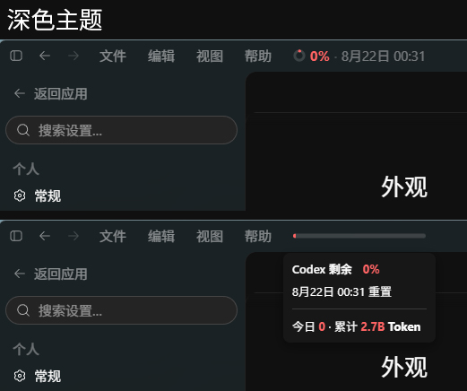
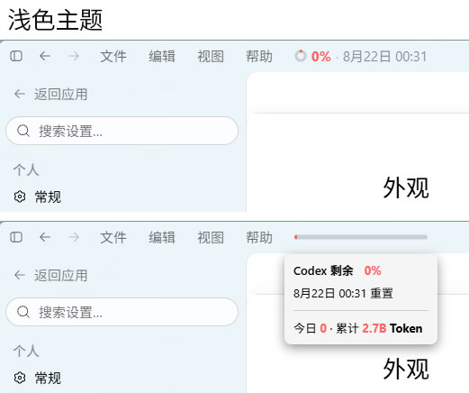
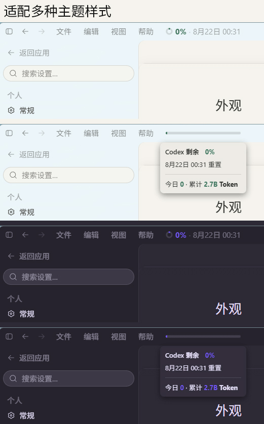

# Codex Usage Bar

> 在 Windows 版 Codex 顶部菜单栏中显示额度与 Token 使用情况，并尽量保持与 Codex 原生 UI 一致。
>
> Unofficial third-party integration for the OpenAI Codex desktop app on Windows.


> [!IMPORTANT]
> 本项目是第三方工具，不属于 OpenAI 官方产品，也不修改 Codex 的 `WindowsApps` 文件、`app.asar` 或应用签名。

## 效果预览

### 深色主题



### 浅色主题



### 其他主题



## 功能

- 在 Codex 顶部原生菜单栏中增加 `Usage` 项。
- 圆环 / 横向进度条动态显示实际剩余额度，低于 2% 时保留 2% 的最低可见长度。
- 下拉菜单显示额度、重置时间、今日 Token 和累计 Token。
- 自动同步 Codex 的深浅主题、强调色、字体、字号、菜单背景、阴影、圆角与分隔线样式。
- 下拉菜单宽度自适应内容，同时不会小于顶部 Usage 菜单原始宽度。
- 支持原生 Menubar 的鼠标横移切换行为。
- 自动刷新额度与 Token，也可以从系统托盘手动刷新。
- Windows 托盘菜单支持“刷新 / 退出”。
- 内置中文和英文；根据 Codex 的 `document.documentElement.lang` 自动选择语言。
- 支持用户自己维护额外语言文件。
- 提供标准 Windows Setup.exe，可覆盖升级，也可以从“已安装的应用”中完整卸载。

## 工作原理

Codex Usage Bar 使用的是**外部注入**方案，而不是修改 Codex 安装包。

```text
Windows 登录 / 启动插件
        │
        ▼
CodexUsageBar.WatcherHost.exe
        │
        │ 监听官方 OpenAI.Codex 的 ChatGPT.exe
        ▼
确认 Codex CDP 会话
        │
        ├─ 已启用 CDP → 直接连接
        │
        └─ 未启用 CDP → 最多自动重启 Codex 一次以启用本机 CDP
                          │
                          └─ 失败后启用 restart fuse，直到 Codex 完全退出前不再重启
        │
        ▼
injector.mjs
        │
        ├─ 通过本机 loopback CDP 注入 renderer-inject.js
        │
        └─ 启动 Codex app-server（stdio）读取账户数据
        │
        ▼
renderer-inject.js
        │
        └─ 在 Codex 原生菜单栏中渲染 Usage Bar
```

### 数据来源

插件通过 Codex 自己的 app-server 接口读取：

- `account/rateLimits/read`：额度 / Rate Limits。
- `account/usage/read`：Token 使用量。
- `account/rateLimits/updated`：额度更新事件。

额度通常最多每 2 分钟主动刷新一次，并会响应 app-server 的额度更新事件；Token 使用量每 10 分钟主动刷新一次。插件启动、app-server 重连以及托盘点击“刷新”时会立即读取最新数据。

### CDP 安全边界

- 只接受 `127.0.0.1` / `::1` 的本机 CDP 地址。
- 默认 CDP 端口为 `9335`。
- Watcher 会校验目标进程属于已注册的官方 `OpenAI.Codex` Store 包。
- 不接管 WindowsApps 权限。
- 不 patch `app.asar`。
- 不修改 Codex 应用签名。
- 自动重启存在一次性 restart fuse，避免失败时形成重启循环。

## 系统要求

- Windows 10 / 11 x64。
- Microsoft Store 安装的官方 `OpenAI.Codex` 桌面应用。
- Windows PowerShell 5.1 或更高版本。
- 正常情况下插件会优先使用 Codex 自带的 Node.js；如果当前 Codex 包没有可用运行时，则需要 `Node.js 22+` 位于 `PATH`。

如果只是下载安装 Release 的 Setup.exe，**不需要安装 Inno Setup**。Inno Setup 只在从源码构建安装包时需要。

## 安装

### 推荐：使用 Release 安装包

1. 打开本仓库的 [Releases](https://github.com/Liuxiny/codex-usage-bar/releases)。
2. 下载最新的：

   ```text
   CodexUsageBar-Setup-vX.Y.Z.exe
   ```

3. 完全退出 Codex。
4. 双击 Setup.exe 完成安装。
5. 之后仍然按原来的方式从开始菜单或任务栏启动 Codex。

首次自动接管一个没有启用 CDP 的 Codex 会话时，Codex **可能自动重启一次**。这是当前注入模型的一部分；如果自动接管失败，restart fuse 会阻止同一会话继续循环重启。

安装默认位于：

```text
%LOCALAPPDATA%\Programs\CodexUsageBar
```

运行状态和日志位于：

```text
%LOCALAPPDATA%\CodexUsageBar
```

## 日常使用

插件安装后会在 Windows 通知区域显示 Codex Usage Bar 图标。

托盘菜单：

- **刷新 / Refresh**：立即刷新额度、Token 和语言资源，不重启 Codex。
- **退出 / Exit**：退出当前 Usage Bar、停止 injector 和 watcher；不会卸载插件。下次 Windows 登录时会再次启动。
- 双击托盘图标：等同于“刷新”。

完全不想继续使用时，请使用 Windows 的标准卸载功能，而不是只点击托盘“退出”。

## 多语言

内置语言：

```text
locales/
├─ en.json
└─ zh.json
```

语言跟随 Codex 的：

```js
document.documentElement.lang
```

匹配规则：

1. 所有中文 locale（`zh`、`zh-CN`、`zh-TW`、`zh-Hans`、`zh-Hant` 等）统一使用 `zh.json`。
2. 其他语言先匹配完整 locale，例如 `pt-BR`。
3. 没有完整 locale 时，再匹配主语言，例如 `pt`。
4. 没有维护对应语言时回退到 `en.json`。
5. 百分比、Token 数字和其他数值不会被翻译或重新格式化。

用户维护的额外语言文件放在：

```text
%LOCALAPPDATA%\CodexUsageBar\locales\
```

例如：

```text
ja.json
de.json
fr.json
pt-br.json
```

这些用户语言文件不会被普通升级覆盖。修改后点击托盘“刷新”即可重新加载。

## 卸载

打开：

```text
Windows 设置
→ 应用
→ 已安装的应用
→ Codex Usage Bar
→ 卸载
```

卸载器会先：

1. 停止 WatcherHost。
2. 在 CDP 可用时移除当前页面中的 Usage Bar。
3. 停止 injector。
4. 清理插件状态、日志和受管 runtime。
5. 删除用户级自动启动项。
6. 最后由 Inno Setup 删除安装目录。

不会修改或卸载 Codex 本体。

## 从源码构建

### 1. 克隆仓库

```powershell
git clone https://github.com/Liuxiny/codex-usage-bar.git
cd codex-usage-bar
```

### 2. 安装构建依赖

需要：

- Windows 10 / 11。
- PowerShell 7（推荐用于构建）。
- [Inno Setup 6](https://jrsoftware.org/isinfo.php)。
- Windows 自带的 .NET Framework C# compiler（`csc.exe`）。

### 3. 运行自检

```powershell
powershell.exe -NoProfile -ExecutionPolicy RemoteSigned `
  -File .\codex-usage-bar.ps1 -SelfTest
```

### 4. 构建 Setup.exe

如果 `ISCC.exe` 能被自动找到：

```powershell
pwsh.exe -NoProfile -ExecutionPolicy RemoteSigned `
  -File .\installer\build-release.ps1
```

如果 Inno Setup 安装在自定义位置：

```powershell
pwsh.exe -NoProfile -ExecutionPolicy RemoteSigned `
  -File .\installer\build-release.ps1 `
  -InnoCompiler 'D:\Program Files (x86)\Inno Setup 6\ISCC.exe'
```

也可以设置环境变量：

```powershell
[Environment]::SetEnvironmentVariable(
  'INNO_SETUP_COMPILER',
  'D:\Program Files (x86)\Inno Setup 6\ISCC.exe',
  'User'
)
```

构建成功后生成：

```text
dist\CodexUsageBar-Setup-v0.4.16.exe
```

构建脚本会同时输出 SHA-256。

### 5. 手动运行源码版本（开发调试）

完全退出 Codex 后，可以执行：

```powershell
powershell.exe -NoProfile -ExecutionPolicy RemoteSigned `
  -File .\codex-usage-bar.ps1 -Launch -RestartExisting
```

停止源码版本：

```powershell
powershell.exe -NoProfile -ExecutionPolicy RemoteSigned `
  -File .\codex-usage-bar.ps1 -Stop
```

> `-RestartExisting` 允许为了启用本机 CDP 而重启当前 Codex；普通用户建议使用 Release 安装版，不需要手动运行这些命令。

## 项目结构

```text
codex-usage-bar/
├─ assets/
│  ├─ codex-usage-bar-logo.png
│  └─ codex-usage-bar.ico
├─ installer/
│  ├─ build-release.ps1
│  ├─ codex-usage-bar.iss
│  └─ watcher-host.cs
├─ locales/
│  ├─ en.json
│  ├─ zh.json
│  └─ README.md
├─ pic/
│  ├─ codex-usage-bar_dark.jpg
│  ├─ codex-usage-bar_light.jpg
│  └─ codex-usage-bar_other_theme.jpg
├─ codex-usage-bar.ps1
├─ injector.mjs
├─ renderer-inject.js
├─ setup-bootstrap.ps1
├─ INSTALL-WINDOWS.md
└─ VERSION
```

主要组件：

| 文件 | 作用 |
| --- | --- |
| `CodexUsageBar.WatcherHost.exe` | 安装时由源码编译生成的原生 Windows watcher / tray host |
| `codex-usage-bar.ps1` | Codex 发现、CDP 启动/验证、injector 生命周期管理 |
| `injector.mjs` | 连接 CDP、启动 app-server、读取额度与 Token、注入 renderer |
| `renderer-inject.js` | Codex 内的 Usage UI、动画、主题同步、菜单交互和语言匹配 |
| `setup-bootstrap.ps1` | 安装、升级、启动 watcher 与卸载清理 |
| `installer/build-release.ps1` | 构建 WatcherHost.exe 和 Inno Setup 安装包 |

## 日志与故障排查

主要日志位于：

```text
%LOCALAPPDATA%\CodexUsageBar\
```

常见文件包括：

```text
launcher.log
injector.log
injector-error.log
watcher-host.log
watcher-fuse.json
```

如果出现启动失败，请在提交 Issue 前先附上相关日志片段，并删除其中可能包含的本机路径或其他私人信息。

## 发布说明

Release 建议至少附带：

```text
CodexUsageBar-Setup-vX.Y.Z.exe
SHA256
```

Setup.exe 当前未使用商业代码签名证书，因此 Windows SmartScreen 或第三方杀毒软件可能对新版本产生信誉提示。请始终从本仓库 Releases 下载，并核对发布页提供的 SHA-256。

## 致谢

本项目的安装器与可恢复安装/卸载思路参考了社区中成熟的 Codex / Electron 扩展项目实践；感谢相关开源社区提供的实现经验。
